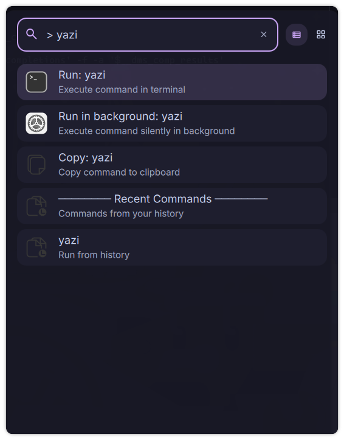

# Command Runner

A DankMaterialShell launcher plugin for executing shell commands directly from the launcher with history tracking and preset shortcuts.



## Features

- **Execute Commands** - Run any shell command in terminal or background
- **Command History** - Track and reuse recently executed commands
- **Common Shortcuts** - Quick access to frequently used commands (htop, btop, ncdu, etc.)
- **Terminal Support** - Auto-detect or configure your preferred terminal emulator
- **Background Execution** - Run commands silently without opening a terminal
- **Clipboard Copy** - Copy commands to clipboard before executing
- **Configurable Trigger** - Default `>` or set your own trigger

## Installation

### From Plugin Registry (Recommended)
```bash
# Coming soon - will be available via DMS plugin manager
```

### Manual Installation
```bash
# Copy plugin to DMS plugins directory
cp -r CommandRunner ~/.config/DankMaterialShell/plugins/

# Enable in DMS
# 1. Open Settings (Ctrl+,)
# 2. Go to Plugins tab
# 3. Click "Scan for Plugins"
# 4. Toggle "Command Runner" to enable
# 5. Configure your terminal emulator in plugin settings
```

## Configuration

**Important**: Configure your terminal before first use!

1. Open Settings → Plugins → Command Runner
2. Set **Terminal**: Your terminal emulator (e.g., `kitty`, `alacritty`, `foot`)
3. Set **Exec flag**: The flag for executing commands (e.g., `-e` for most terminals)

### Common Terminal Configurations

| Terminal | Command | Exec Flag |
|----------|---------|-----------|
| kitty | `kitty` | `-e` |
| alacritty | `alacritty` | `-e` |
| foot | `foot` | `-e` |
| wezterm | `wezterm` | `start` |
| gnome-terminal | `gnome-terminal` | `--` |
| konsole | `konsole` | `-e` |
| xterm | `xterm` | `-e` |

## Usage

### Execute Commands in Terminal
Note: Avoid triggers reserved by DMS or other plugins (e.g., `/` is used for file search).

1. Open launcher (Ctrl+Space)
2. Type `>` followed by command
3. Examples:
   - `> htop` - System monitor
   - `> btop` - Modern resource monitor
   - `> ls -la` - List files with details
   - `> journalctl -f` - View live system logs
4. Select "Run: command" and press Enter

### Execute Commands in Background
1. Type command as above
2. Select "Run in background: command"
3. Command executes silently without terminal window

### Copy Command to Clipboard
1. Type command
2. Select "Copy: command"
3. Command copied to clipboard for use elsewhere

### Use Command History
- Recent commands appear automatically in the list
- Click any historical command to re-execute
- History persists across sessions

### Common Command Shortcuts
Access pre-configured shortcuts without typing:
- `htop` - Interactive process viewer
- `btop` - Resource monitor
- `ncdu` - Disk usage analyzer
- `nmtui` - Network manager TUI
- `ranger` - File manager
- `neofetch` / `fastfetch` - System info
- And more!

## Settings

- **Trigger**: Set custom trigger (`>`, `$`, `!`, `run`, etc.) or disable for always-on
  - Avoid triggers reserved by DMS or other plugins (e.g., `/` is used for file search).
- **Terminal Emulator**: Configure which terminal to use
- **Exec Flag**: Set the command execution flag for your terminal
- **Max History Items**: Configure history size (1-100 items)
- **Clear History**: Remove all stored commands

## Examples

### System Monitoring
```
> htop              # Interactive process viewer
> btop              # Modern resource monitor
> journalctl -f     # Live system logs
> df -h             # Disk usage
> free -h           # Memory usage
```

### File Operations
```
> ls -la            # List all files
> ncdu ~            # Analyze disk usage
> ranger            # File manager
```

### Network
```
> nmtui             # Network manager
> ip addr           # Network interfaces
> ping 8.8.8.8      # Test connectivity
```

### Development
```
> vim config.txt    # Edit file in vim
> git status        # Check git status
> npm install       # Install packages
```

## Requirements

- DankMaterialShell >= 0.1.0
- Terminal emulator (kitty, alacritty, foot, etc.)
- `wl-copy` (for clipboard support)
- Wayland compositor

## Compatibility

- **Compositors**: Niri and Hyprland
- **Distros**: Universal - works on any Linux distribution
- **Terminals**: Supports all major terminal emulators

## Technical Details

- **Type**: Launcher plugin
- **Trigger**: `>` (configurable)
- **Language**: QML (Qt Modeling Language)
- **Storage**: Command history stored in DMS settings

## Troubleshooting

### Commands not launching?
1. Verify terminal is configured in plugin settings
2. Check terminal is installed: `which kitty` (or your terminal)
3. Verify exec flag matches your terminal

### Terminal opens but command doesn't run?
- Ensure exec flag is correct for your terminal
- Most terminals use `-e`, but some (wezterm) use `start`

## Contributing

Found a bug or want to add features? Open an issue or submit a pull request!

## License

MIT License - See LICENSE file for details

## Author

Created for the DankMaterialShell community

## Links

- [DankMaterialShell](https://github.com/AvengeMedia/DankMaterialShell)
- [Plugin Registry](https://github.com/AvengeMedia/dms-plugin-registry)
